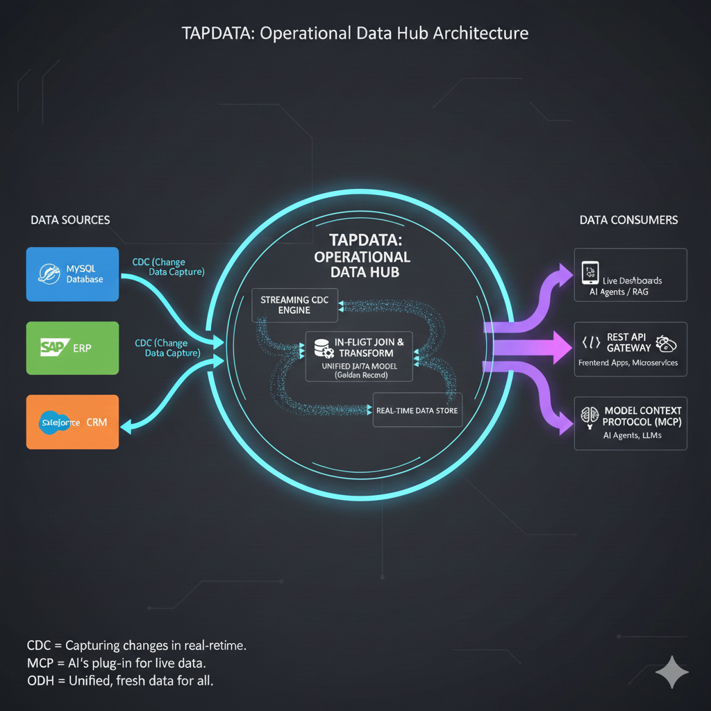

# TapData: The Live Data Platform for Apps & AI

### **Turn Fragmented Databases into Real-Time REST APIs & MCP Tools in Minutes.**

**TapData** is an open-source platform that automates the "Last Mile" of data. It uses real-time **CDC (Change Data Capture)** to transform static databases into high-performance, auto-updating **REST APIs** and **Model Context Protocol (MCP)** tools.

Whether you are building a modern React frontend, a microservice, or a real-time AI Agent, Tapdata provides the live data layer so you can stop writing glue code and start building features.

**Stop moving data. Start serving it.**

---

## ⚡ The 5-Minute Hook

Tapdata eliminates the need for complex "Data Plumbing." In minutes, you can transform a static database into a live data service:

1. **Connect:** Link your sources (Oracle, MySQL, Postgres, MongoDB, Salesforce, etc.).
2. **Unify:** Join silos in-flight (e.g., `Billing` + `CRM`) into a single "Golden Record."
3. **Serve:** Instantly publish a **Live API** for your frontend or an **MCP Tool** for your AI Agents.


---

## 🏗️ Architecture: The Live Data Serving Layer

Tapdata acts as the central nervous system for your operational data. It captures changes from your systems of record, unifies them in-flight, and serves them to your modern application stack.



*The flow: Real-time CDC from Oracle/MySQL/Salesforce ➔ Streaming Joins ➔ Instant API & MCP Serving.*
 
---


## ⚡ Instant Database-to-API

Tapdata provides a "Zero-Code" path to serve your data with sub-second freshness:

* **Auto-Generated Endpoints:** Instantly create `GET`, `POST`, and `PATCH` endpoints for any table.
* **Live Materialized Views:** Join `Orders` (Oracle) + `Customers` (MySQL) in-flight and serve a unified JSON response.
* **AI-Ready (MCP):** A native **MCP Server** interface to give your AI Agents (Claude, GPT) a live "eye" into your production systems.

---

## 🤖 Built for the AI Era (MCP & RAG)

AI Agents are only as smart as the context they can access. Tapdata ensures your LLMs never "hallucinate" on stale data:

* **Native MCP Server:** Tapdata acts as a bridge, exposing enterprise databases as "Tools" and "Resources" that AI Agents (Claude, GPT) can query directly.
* **Real-Time RAG:** Feed Vector Databases (Milvus, Pinecone, Weaviate) with a sub-second stream of fresh operational data.
* **Contextual Intelligence:** Your AI Agent knows about a transaction the millisecond it happens in your production database.

---

## 🔗 Collapse the Silos: Build Your Operational Data Hub

Use Tapdata to build a **Consolidated Data Layer** that stays in sync with your business.

* **Break Data Silos:** Automatically merge data from a legacy ERP and a modern web app into a single, unified view.
* **Streaming Joins:** Perform complex aggregations and joins *while data is moving*, creating materialized views that are always "ready-to-serve."
* **Single Source of Truth:** Built on a native CDC engine, your unified data is always fresh, accurate, and ready for consumption.

---


## 🌟 Key Features

* **Real-Time CDC:** Log-based capture for 100+ connectors with sub-second latency.
* **Visual Stream Processing:** A drag-and-drop designer for joins, filters, and JavaScript-based transformations.
* **API Gateway:** Built-in management, documentation, and security for your published data endpoints.
* **Extensible PDK:** Use our Plugin Development Kit to build custom connectors or AI data-transformers in Java or Python.


## 🆚 How Tapdata Compares

### 1. Tapdata vs. "Query Translators" (Hasura / PostgREST)

While tools like Hasura wrap your DB in an API, they hit your production database with a new query for every API request.

* **The Tapdata Edge:** We use CDC to move data to a **Serving Layer** first. Your production DB stays fast, and your API stays responsive, even under heavy load.

### 2. Tapdata vs. "The Big Stack" (Debezium + Kafka + Flink)

Building a real-time pipeline with Debezium, Kafka, and Flink is powerful but requires a dedicated team to maintain.

| Feature | Debezium + Kafka + Flink | Tapdata Platform |
| --- | --- | --- |
| **Complexity** | 3+ distributed systems to manage | **Single, integrated platform** |
| **Development** | Writing Java/Scala code | **Visual drag-and-drop / JS** |
| **Schema Evolution** | Manual / Brittle | **Automated & Handled** |
| **Data Serving** | Requires additional API layer | **Native REST & MCP Publishing** |
| **Time to Market** | Months | **Minutes** |

---

## 🚀 Performance & Scalability

Tapdata is engineered for high-concurrency, low-latency operational environments.

* **Production Offloading:** Our CDC engine reads **transaction logs** (Redo/Binlog), ensuring near-zero impact on your production databases.
* **Sub-Second Latency:** Data is pre-joined and pre-calculated in the stream, serving API requests from a high-speed document store.
* **Horizontal Scaling:** Tapdata nodes can be clustered to handle massive throughput and high-availability requirements.


---

## 🚀 Quick Start (Docker)

Get Tapdata up and running in under 60 seconds:

```bash
git clone https://github.com/tapdata/tapdata.git
cd tapdata
docker-compose up -d

```

Access the dashboard at `http://localhost:3030` to build your first live data product.

---
 

## 🤝 Contributing

We are building the future of active data. Whether you're adding a new connector, improving the MCP interface, or fixing a bug, we welcome your contributions!

* **[Contribution Guide](https://www.google.com/search?q=CONTRIBUTING.md)**
* **[Join our Slack Community](https://www.google.com/search?q=https://tapdata.io/slack)**

---

## 📄 License

Tapdata is licensed under the Apache 2.0 License.

---

 
 
